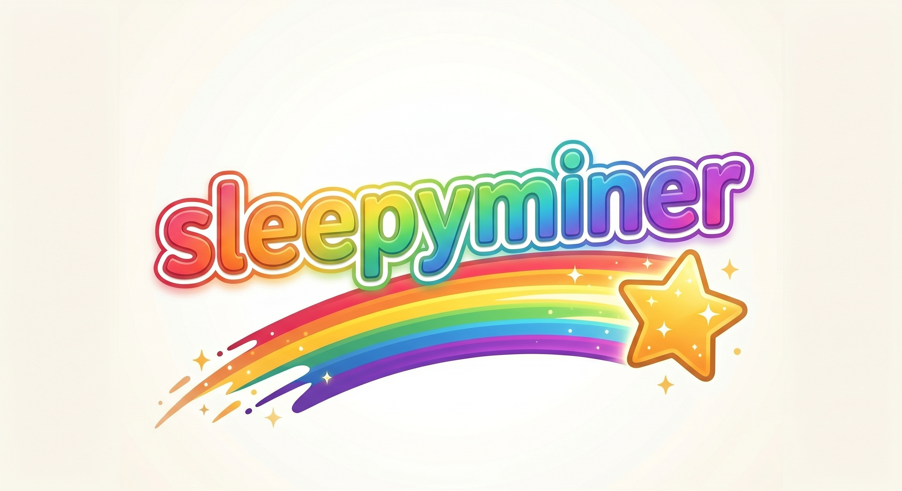

<p align="center">                                                                                                       
                                                       
</p> 

# sleepyminer

A native RandomX (Monero / XMR) CPU miner for Apple Silicon. Mines while
your Mac is idle, scales down the moment you start using the machine.

[](https://www.gnu.org/licenses/gpl-3.0)

> **Dev fee:** 1% of mining cycles go to the project's wallet on
> MoneroOcean. This is configurable down to a 1% minimum via the
> `--donate-level` flag. The mechanism and address are documented in
> the [Donations](#donations) section below.

## Why

Most existing RandomX miners run flat-out and are noisy on a daily-driver
laptop or desktop. Sleepyminer is built for the case where the Mac is
yours first and a miner second:

- **Adaptive thread scaling**: ramps from 1 thread up to your machine's
  full performance-core count only when the Mac is idle. Backs off to
  1 thread the instant your input idle time drops.
- **Wizard-driven first run**: type `sleepyminer` once with no config,
  pick Monero-direct or NiceHash, paste a wallet, and it's mining.
- **Apple-Silicon-tuned RandomX**: the ARM64 hot paths are derived
  from xmrig's actively-maintained code with additional tuning
  applied on top (see [Acknowledgements](#acknowledgements) and
  `CREDITS.md`).

It's a single static binary. No Python, no Docker, no daemon.

## Performance

On an Apple M4 Pro (10 P-cores + 4 E-cores, 64 GB RAM), running with
12 threads on the standalone RandomX benchmark:

| Miner                              | H/s @ 12 threads |
|------------------------------------|------------------|
| Stock RandomX reference            | ~1,800           |
| xmrig 6.25 / xmrig dev (Apr 2026)  | ~3,950           |
| **sleepyminer**                    | **~4,420**       |

That's roughly 12% over xmrig on Apple Silicon. The hash output is
bit-identical — sleepyminer passes the upstream RandomX 105-test
correctness suite. Your numbers will vary with thermals, background
load, and chip variant; on M1 / M2 / M3 generations the relative
ranking holds but absolute numbers shift.

## Download

Pre-built macOS arm64 binaries are attached to each release on the
GitHub releases page. Each release ships:

- `sleepyminer-<version>-macos-arm64.tar.gz` — the binary plus README,
  LICENSE, CREDITS, and an example config
- `SHA256SUMS` — checksums for the tarball
- `SHA256SUMS.sig` — GPG-detached signature over `SHA256SUMS`

### Verify a download

The signing key fingerprint is published in this repo as
`grumpy-signing-key.asc`. Verification flow:

```bash
# Once: import the key
gpg --import grumpy-signing-key.asc

# For each release: verify
gpg --verify SHA256SUMS.sig SHA256SUMS
shasum -a 256 -c SHA256SUMS
```

If the GPG signature verifies and the SHA256 of your downloaded
tarball matches the line in `SHA256SUMS`, you're good.

### macOS Gatekeeper

The binary is not Apple-Developer-ID signed (the project is run under
a pseudonym). On first launch macOS will refuse to run it. Clear the
quarantine attribute once:

```bash
xattr -d com.apple.quarantine ./sleepyminer
```

Or right-click the binary in Finder and pick *Open* the first time.

## Quick start

```bash
./sleepyminer
```

That's the whole thing. On a fresh system with no config, the wizard
walks you through:

1. Pick a path: traditional Monero (paid in XMR to your Monero wallet)
   or NiceHash (paid in BTC).
2. Enter your wallet address.
3. Pick a pool (or paste a custom one).
4. Pick adaptive thread scaling (default) or a fixed thread count.

The config gets saved to `~/.sleepyminer/config.json`. After that,
every subsequent `./sleepyminer` invocation reads it and starts mining
straight away.

### CLI flags

```
USAGE:
    sleepyminer [OPTIONS] [SUBCOMMAND]

OPTIONS:
    -c, --config <PATH>         Config file path
                                [default: ~/.sleepyminer/config.json]
    -o, --url <URL>             Pool URL (overrides config)
    -u, --user <WALLET>         Wallet address (overrides config)
    -p, --pass <PASS>           Pool password [default: x]
    -t, --threads <N>           Force fixed thread count
                                (disables adaptive scaling)
        --donate-level <PCT>    Dev donation percentage (min 1)
                                [default: 1]
    -v, --verbose               Verbose logging
    -h, --help                  Print help

SUBCOMMANDS:
    run                  Run the miner (default)
    setup                Re-run the interactive wizard
    benchmark            Sweep thread counts and find optimum
    install-service      Install macOS launchd service for login startup
    uninstall-service    Remove macOS launchd service
```

### Examples

Mine to a Monero pool with adaptive scaling:

```bash
./sleepyminer -o pool.supportxmr.com:3333 -u <your-XMR-address> -p x
```

Mine to NiceHash with 8 fixed threads:

```bash
./sleepyminer -o randomxmonero.auto.nicehash.com:443 \
              -u <BTC-address>.<rig-name> -p x -t 8
```

Re-run the wizard from an existing install:

```bash
./sleepyminer setup
```

Run a thread-count sweep to find the H/s optimum on your machine:

```bash
./sleepyminer benchmark
```

Install a login-launched mining service (background-mines while you
work):

```bash
./sleepyminer install-service
```

## Build from source

Sleepyminer is a Cargo project that wraps a vendored copy of the
RandomX C++ library. Building produces a single self-contained binary.

### Requirements

- macOS 13+ on Apple Silicon (arm64)
- Rust 1.78+ (`rustup` or `brew install rustup-init`)
- Xcode Command Line Tools (`xcode-select --install`)
- CMake 3.20+ (`brew install cmake`)

That's it. The vendored RandomX C++ tree is built automatically by
`cargo` via the `cmake` crate; you do not need to invoke cmake yourself.

### Build

```bash
git clone https://github.com/<your-fork>/sleepyminer.git
cd sleepyminer
cargo build --release
```

The binary is at `target/release/sleepyminer`.

A first build takes ~30s on M-series silicon (most of which is the
RandomX C++ compile). Subsequent builds reuse the C++ artifacts.

### Run tests

The Rust side has minimal tests:

```bash
cargo test --release
```

The vendored RandomX tree has its own test suite (`randomx-tests`) that
verifies the local hot-path modifications produce bit-identical output
to upstream RandomX. These tests are run during release builds in CI;
to run them locally you'd need to invoke the vendor's CMake build
directly:

```bash
cd vendor/randomx
mkdir -p build && cd build
cmake -DCMAKE_BUILD_TYPE=Release ..
make -j$(sysctl -n hw.ncpu)
./randomx-tests
```

You should see `All tests PASSED`.

## Donations

Sleepyminer takes a 1% dev fee, time-sliced from your mining cycles.
Concretely:

- For every 99 minutes you mine to your configured pool/wallet, the
  miner spends ~1 minute mining to a project-controlled wallet on
  MoneroOcean.
- The fee is configurable via `--donate-level <PCT>`. The minimum
  enforced level is 1; passing `0` is rejected at startup.
- The fee is implemented in `src/donation/mod.rs`. There are no hidden
  channels, no second wallet, no off-by-default surprise modes — the
  full donation flow is in that file and is logged to the console
  every time the cycle flips:

      ★ donation cycle START — mining to dev pool for 60s
      ✓ donation cycle END   — resuming user pool for 5940s

If you'd like to support the project beyond the built-in fee, the same
wallet accepts direct contributions:

```
82vnSSqeHAyhhbrHXtJkhFAEYUrCGgbdSQXb7rZBTxXSFZswAvoaBHfQLtK3QizSfzjUpgExRm5CMjPWyea41WvdUcaAz6m
```

## Acknowledgements

Sleepyminer is built on years of work by others. See [`CREDITS.md`](CREDITS.md)
for the full attribution. In short:

- **RandomX** is the work of tevador and contributors
  (<https://github.com/tevador/RandomX>, BSD-3).
- **xmrig** (<https://github.com/xmrig/xmrig>, GPL-3) is the
  reference Monero miner; sleepyminer's ARM64 hot paths are derived
  from xmrig's source.
- The local hot-path modifications on top of xmrig were generated
  through automated search against the upstream RandomX correctness
  test suite.

Because the modified RandomX hot-path files inherit GPL-3 from xmrig,
sleepyminer as a whole is GPL-3 (see `LICENSE`).

## License

GPL-3.0-or-later. See `LICENSE`.

## Contact

GitHub Issues only. There is no email contact channel for the project.
